# **Skeletal Terms, Bone Histology, and Microanatomy**

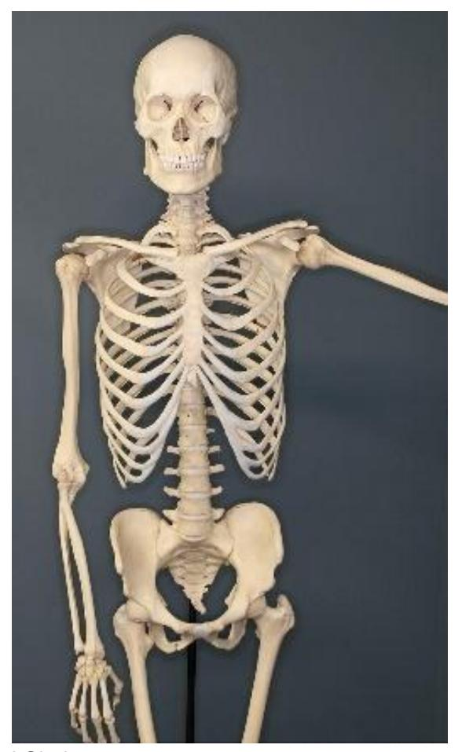

**Figure 6.1** An Articulated Skeleton.

### **Your objectives for this lab are to:**

-   Identify the major divisions of the skeleton (axial vs. appendicular) and which bones belong to each group.

-   Classify bones according to their shapes.

    -   Long bone
    -   Short bone
    -   Flat bone
    -   Irregular bone
    -   Sesamoid bone

-   Describe the function of each category of bones.

-   Provide examples of each type of bone classification by shape

-   Identify disarticulated bones as left or right and describe how this determination was made.

-   **In a real bone and in models of bone structure, locate and define the functions of the following macroscopic features.**

    -   Compact/cancellous bone
    -   Spongy bone/trabecular bone
    -   Epiphysis
    -   Diaphysis
    -   Medullary cavity
    -   Red bone marrow
    -   Yellow bone marrow
    -   Articular cartilage
    -   Epiphyseal line
    -   Periosteum
    -   Endosteum

-   **In models of microscopic bone structure, locate and define the functions of**

    -   Central (Haversian) canal
    -   Perforating (Volkmann's) canal
    -   Lacuna(e)
    -   Canaliculi
    -   Osteocytes
    -   Lamella(e)
    -   Trabeculae
    -   Osteon
    -   Compact/cancellous bone
    -   Spongy bone/trabecular bone
    -   Medullary cavity
    -   Red bone marrow
    -   Periosteum
    -   Endosteum

-   **In a compact bone picture, identify and define the functions of**

    -   Central canal
    -   Lacuna(e)
    -   Canaliculi
    -   Osteocytes
    -   Lamella(e)

## **Prelab Activities**

## **Prelab Activity 6.1**

Definitions: Define the following key terms

**Skeleton**

-   Axial: skull, thorax, vertebral column
-   Appendicular skeleton: limbs limb girdles

**General Structure of Long Bones** - See description in the textbook.

-   Epiphysis: wide section at each end of long bone
-   Diaphysis: tubular shaft that runs between proximal & distal ends of long bone
-   Compact bone: dense osseous tissue that can withstand compressive forces
-   Spongy bone: trabeculated osseous tissue that supports shifts in weight distribution
    -   network of struts & plates (trabeculae)
-   Hyaline (articular) cartilage: thin layer covering epiphysis
    -   reduces friction & acts as shock absorber
-   Periosteum: fibrous membrane covering outer surface of bone & continuous with ligaments
-   Bone processes: general term for projection
    -   marking where part of surface sticks out above rest of surface
    -   where tendons & ligaments attach
-   Medullary cavity: hollow region of diaphysis; filled with yellow marrow
-   Yellow marrow: connective tissue in interior cavity of bone where fat is stored
-   Red marrow: connective tissue in interior cavity where hematopoiesis takes place
    -   blood cell production
-   Epiphyseal plate: sheet of hyaline cartilage in metaphysis of immature bone; replaced by bone tissue as organ grows in length
-   Endosteum (simple squamous): delicate membranous lining of bone's medullary cavity

**Bone Tissue**

+-------------------+-----------------------------------------------------------------+
| Term              | Definition                                                      |
+===================+=================================================================+
| Osteocytes        | primary cell in mature bone; responsible for maintaining matrix |
+-------------------+-----------------------------------------------------------------+
| Matrix            | extracellular protein fibers & ground substance                 |
+-------------------+-----------------------------------------------------------------+
| Collagen fibers   | 1/3 of bone mass                                                |
|                   |                                                                 |
|                   | -   flexibility, strength vs tension                            |
|                   |                                                                 |
|                   | -   bends if compressed                                         |
+-------------------+-----------------------------------------------------------------+
| Calcium phosphate | 2/3 mass of bone                                                |
|                   |                                                                 |
|                   | -   contributes strength vs compression                         |
|                   |                                                                 |
|                   | -   inflexible and brittle                                      |
+-------------------+-----------------------------------------------------------------+
| Osteoblasts       | builds bone                                                     |
+-------------------+-----------------------------------------------------------------+
| Osteoclasts       | resorbing bone                                                  |
+-------------------+-----------------------------------------------------------------+

**Bone Classification:**

+----------------+-------------------------------------------------------------------------------------+
| Term           | Definition                                                                          |
+================+=====================================================================================+
| Long bones     | cylinder-shaped bone that is longer than it is wide (lever)                         |
+----------------+-------------------------------------------------------------------------------------+
| Short bones    | cube-shaped bone approx. equal in length, width, thickness                          |
|                |                                                                                     |
|                | -   limited motion provided                                                         |
+----------------+-------------------------------------------------------------------------------------+
| Flat bones     | thin & curved; serves as point of attachment for muscles & protects internal organs |
+----------------+-------------------------------------------------------------------------------------+
| Irregular      | complex shape; protects internal organs from compressive forces                     |
+----------------+-------------------------------------------------------------------------------------+
| Sesamoid bones | small, round bone embedded in tendon; protects tendon from compressive forces       |
+----------------+-------------------------------------------------------------------------------------+

## **Prelab Activity 6.2**

## **Labeling**

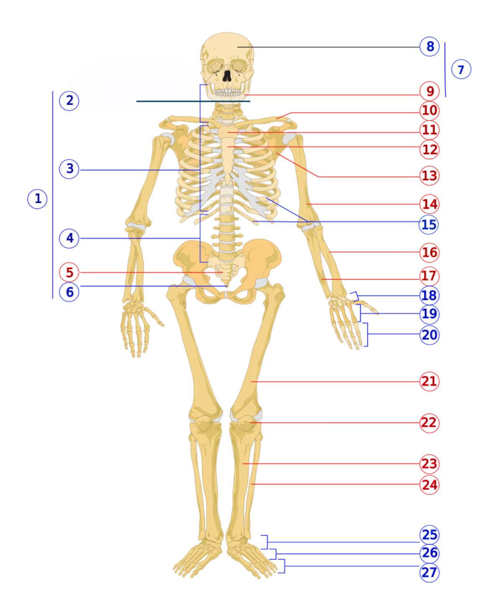

**Figure 6.2** Numbered Human Skeleton.

Identify the bones or regions on Figure 6.2. Indicate whether they belong to the appendicular or axial divisions.

**Table 6.1. Identify the Bones or Regions**

| Number | Name of bone or region | Division of skeletal system |
|--------|------------------------|-----------------------------|
| 1      | spinal column          | axial                       |
| 2      | cervical vertebrae     | axial                       |
| 3      | thoracic vertebrae     | axial                       |
| 4      | lumbar vertebrae       | axial                       |
| 5      | sacrum                 | axial                       |
| 6      | coccyx                 | axial                       |
| 7      | skull                  | axial                       |
| 8      | cranium                | axial                       |
| 9      | mandible               | axial                       |
| 10     | clavicle               | appendicular                |
| 11     | maubrium               | axial                       |
| 12     | sternum                | axial                       |
| 13     | scapula                | appendicular                |
| 14     | humerus                | appendicular                |
| 15     | ribs                   | axial                       |
| 16     | radius                 | appendicular                |
| 17     | ulna                   | appendicular                |
| 18     | carpals                | appendicular                |
| 19     | metacarpals            | appendicular                |
| 20     | phalanges              | appendicular                |
| 21     | femur                  | appendicular                |
| 22     | patella                | appendicular                |
| 23     | tibia                  | appendicular                |
| 26     | metatarsals            | appendicular                |

## **Lab Activities**

Bones of the skeletal system.

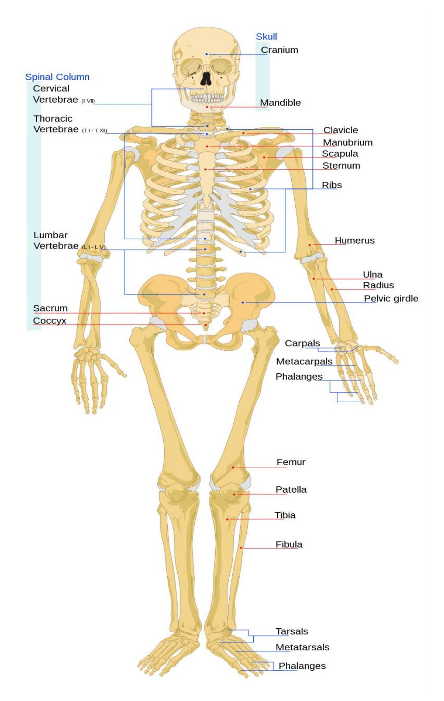

**Figure 6.3** Bones of the Skeletal System.

## **Major Divisions of the Skeletal system**

## **Axial Skeleton**

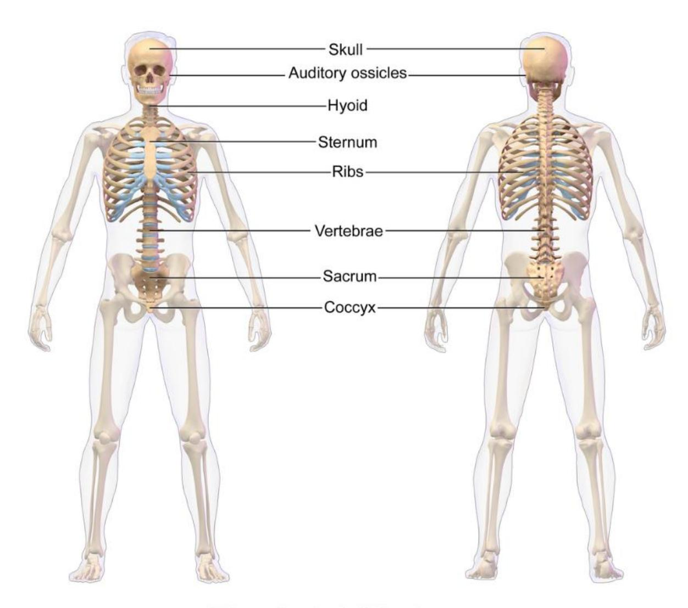

**Figure 6.4** Axial Skeleton.

## **Appendicular Skeleton**

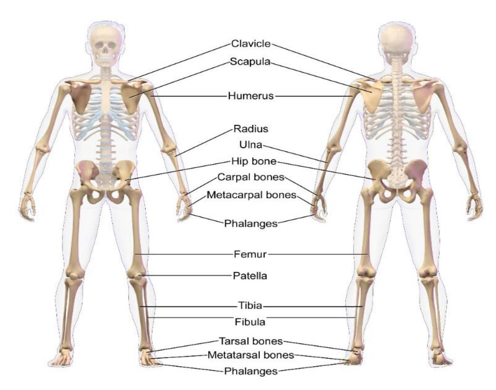

**Figure 6.5** Appendicular Skeleton.

## **Lab Activity 6.1**

Classify the following bones based their location in the major division they are found (axial or appendicular):

| Bones              | Classification |
|--------------------|----------------|
| Sacrum             | axial          |
| Humerus            | appendicular   |
| Phalanges (digits) | appendicular   |
| Cervical Vertebrae | axial          |
| Cranium            | axial          |
| Scapula            | appendicular   |

## **Lab Activities**

## **Bone Features**

Review the Information in this table before moving on to the next activity.

**Table 6.2. Surface Features of Bone**

+----------------+-----------------------------------------------------------------------------------------------+--------------------------------------------------------------------------------------------------------------------------+
| Feature        | Description                                                                                   | Example                                                                                                                  |
+================+===============================================================================================+==========================================================================================================================+
| Articulation   | Where bones meet                                                                              | Elbow joint                                                                                                              |
+----------------+-----------------------------------------------------------------------------------------------+--------------------------------------------------------------------------------------------------------------------------+
| Body           | the largest, most prominent segment of bone.                                                  | diaphysis or shaft of long bones like the femur and humerus.                                                             |
+----------------+-----------------------------------------------------------------------------------------------+--------------------------------------------------------------------------------------------------------------------------+
| Condyle        | large prominence, which often provides structural support to the overlying hyaline cartilage. | knee joint (hinge joint), formed by the femoral lateral and medial condyles, and the tibial lateral and medial condyles. |
+----------------+-----------------------------------------------------------------------------------------------+--------------------------------------------------------------------------------------------------------------------------+
| Diaphysis      | main part of the shaft of a long bone                                                         | humerus or femur bones                                                                                                   |
+----------------+-----------------------------------------------------------------------------------------------+--------------------------------------------------------------------------------------------------------------------------+
| Epicondyle     | A prominence that sits atop of a condyle                                                      | femoral medial and lateral epicondyles and humeral medial and lateral epicondyles.                                       |
+----------------+-----------------------------------------------------------------------------------------------+--------------------------------------------------------------------------------------------------------------------------+
| Epiphysis      | articulating segment of a bone, usually at the bone's proximal and distal poles.              | Ends of the long bone                                                                                                    |
+----------------+-----------------------------------------------------------------------------------------------+--------------------------------------------------------------------------------------------------------------------------+
| Facet          | smooth, flat surface that forms a joint with another flat bone or another facet               | facet joints of the vertebrae                                                                                            |
+----------------+-----------------------------------------------------------------------------------------------+--------------------------------------------------------------------------------------------------------------------------+
| Foramen        | hole through which nerves and blood vessels pass                                              | supraorbital foramen, infraorbital foramen, and mental foramen on the cranium.                                           |
+----------------+-----------------------------------------------------------------------------------------------+--------------------------------------------------------------------------------------------------------------------------+
| Fossa          | A shallow depression in the bone surface                                                      | trochlear fossa, posterior, middle, and anterior cranial fossa                                                           |
+----------------+-----------------------------------------------------------------------------------------------+--------------------------------------------------------------------------------------------------------------------------+
| Head           | rounded, prominent extension of bone that forms part of a joint                               | main articulating surface with the adjacent bone, forming a "ball-and-socket" joint.                                     |
+----------------+-----------------------------------------------------------------------------------------------+--------------------------------------------------------------------------------------------------------------------------+
| Meatus         | tube-like channel that extends within the bone                                                | external acoustic meatus and internal auditory meatus                                                                    |
+----------------+-----------------------------------------------------------------------------------------------+--------------------------------------------------------------------------------------------------------------------------+

**Table 6.2 Surface Features of a Bone Used in Anatomy, continued**

+-----------------+---------------------------------------------------------------------------------------+----------------------------------------------+
| Feature         | Description                                                                           | Example                                      |
+=================+=======================================================================================+==============================================+
| Notch           | depression in a bone which can provide stabilization to an adjacent articulating bone | mandibular notch                             |
+-----------------+---------------------------------------------------------------------------------------+----------------------------------------------+
| Sinus           | cavity within any organ or tissue                                                     | paranasal sinuses                            |
+-----------------+---------------------------------------------------------------------------------------+----------------------------------------------+
| Spinous Process | raised, sharp elevation of bone where muscles and connective tissue attach            | skull at the base of the temporal bone       |
+-----------------+---------------------------------------------------------------------------------------+----------------------------------------------+
| Trochanter      | large prominence on the side of the bone                                              | greater and lesser trochanters of the femur. |
+-----------------+---------------------------------------------------------------------------------------+----------------------------------------------+
| Tuberosity      | moderate prominence where muscles and connective tissues attach                       | tibial tuberosity, deltoid tuberosity        |
+-----------------+---------------------------------------------------------------------------------------+----------------------------------------------+
| Tubercle        | small, rounded prominence where connective tissues attach                             | greater and lesser tubercle of the humerus.  |
+-----------------+---------------------------------------------------------------------------------------+----------------------------------------------+

## **Lab Activity 6.2.**

-   Bones are organs that contain diverse shapes and features. In your assigned group, obtain a set of disarticulated bones or an articulated skeleton from the classroom lab supplies.
-   Use the information from your text and Table 6.2 to locate and identify the features in table 6.2 .
-   When you identify a feature, label it using tape and have your group mates confirm the identification. Ask your instructor to confirm your identification.

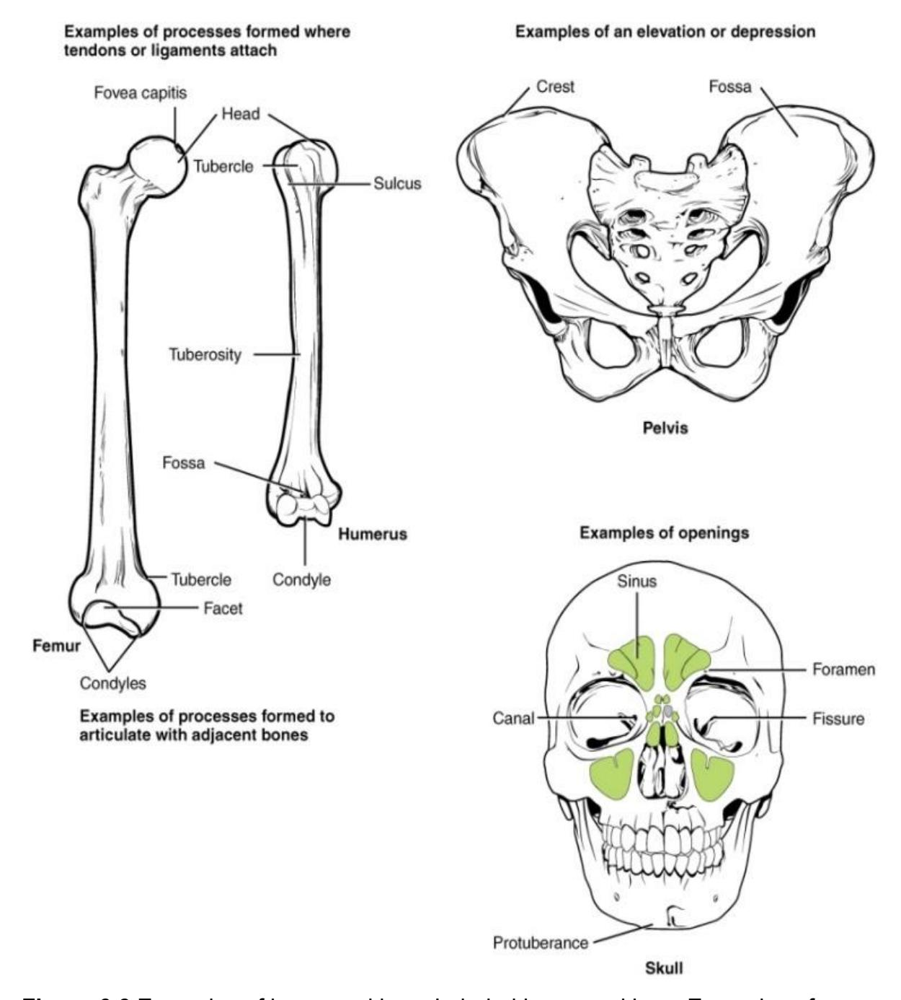

**Figure 6.6** Examples of bone markings. Labeled bone markings, Examples of processes formed where tendons or ligaments attach, processes formed to articulate with adjacent bones, elevation or depressions, and openings.

### **Bone Classification based on Shape.**

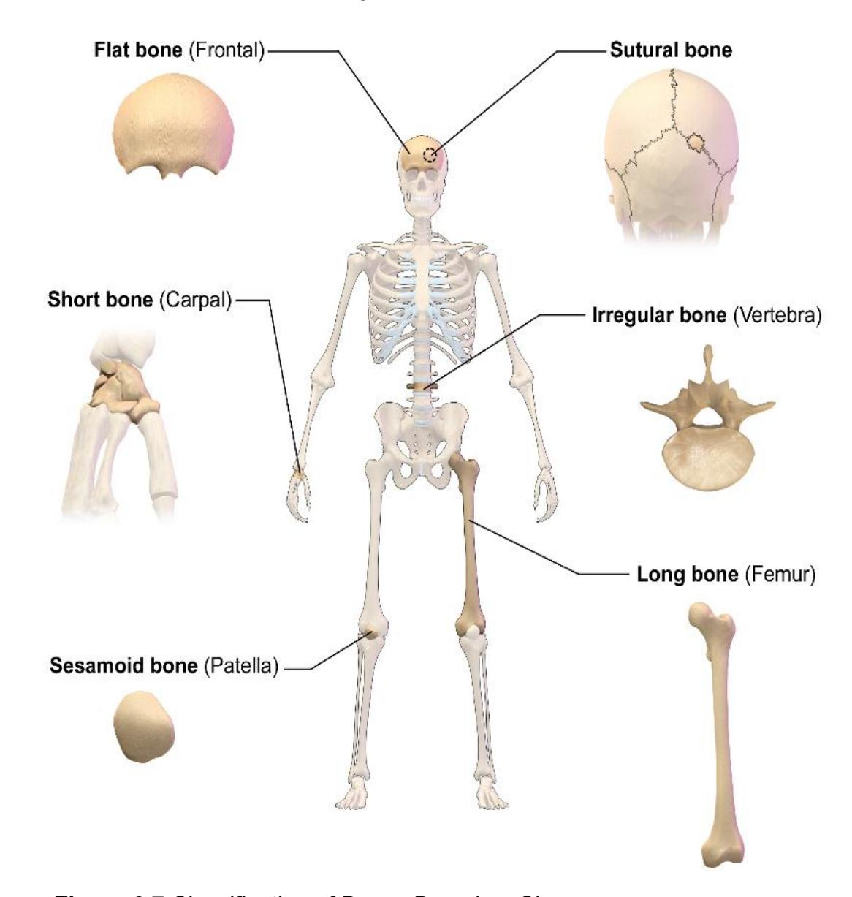

**Figure 6.7** Classification of Bones Based on Shape.

-   The bones of the skeletal system may be classified into five different categories. From the description of the features in table 6.3, find several bones on the articulated skeleton and label them according to their anatomical shape. Complete the table by providing at least two examples of each bone shape.
-   Next, obtain some tape and on a skeletal model or a set of bones from your disarticulated skeleton classify several bones according to their shapes.
-   Complete table 6.3.

**Table 6.3 Bone Classifications Based on Shape**

+----------------+------------------------------------------------------------+-------------------------------------+
| Classification | Features                                                   | Example(s)                          |
+================+============================================================+=====================================+
| Long           | Cylindrical shape; longer than wide                        | femur                               |
+----------------+------------------------------------------------------------+-------------------------------------+
| Short          | Cube shaped length, width, and thickness; relatively equal | carpal                              |
+----------------+------------------------------------------------------------+-------------------------------------+
| Flat           | Thin and wide curved                                       | frontal, sternum                    |
+----------------+------------------------------------------------------------+-------------------------------------+
| Irregular      | Complex shape                                              | vertebra                            |
+----------------+------------------------------------------------------------+-------------------------------------+
| Sesamoid       | Seed shaped small and round                                | patella                             |
+----------------+------------------------------------------------------------+-------------------------------------+

## **Example of Flat Bones**

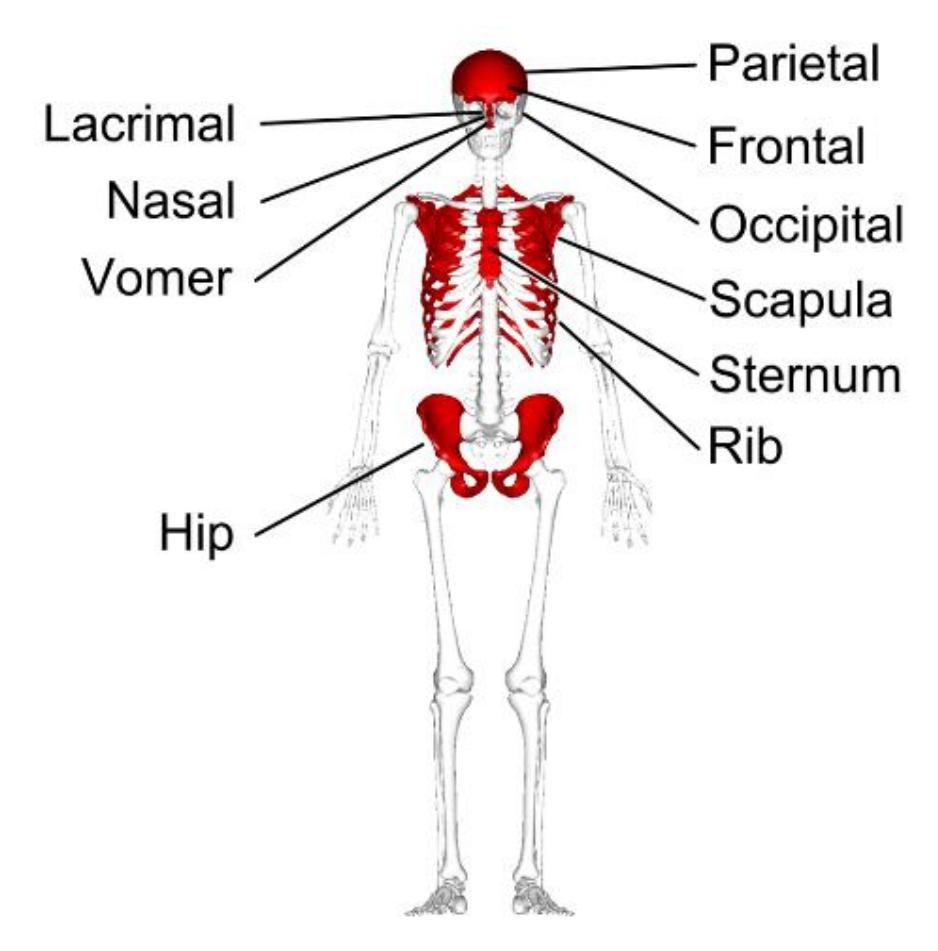

**Figure 6.8** Flat bones in the Skeleton.

## **Anatomy of the Flat Bone**

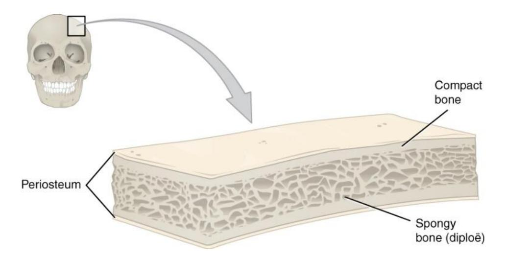

**Figure 6.9** Anatomy of a Flat Bone.

### **Long Bones of the Skeleton**

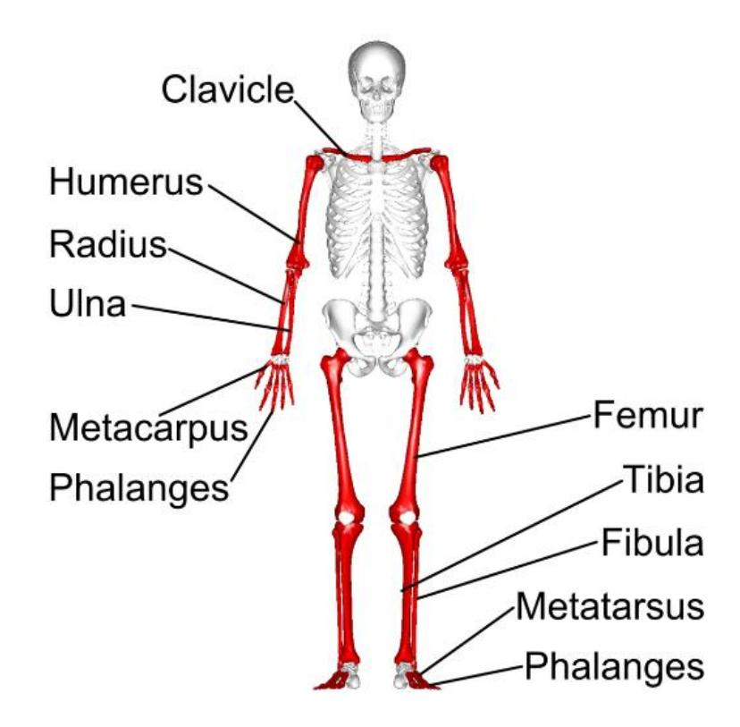

**Figure 6.10** Long bones – Anterior View Shown in Red.

## **Gross Anatomy of the Long Bone**

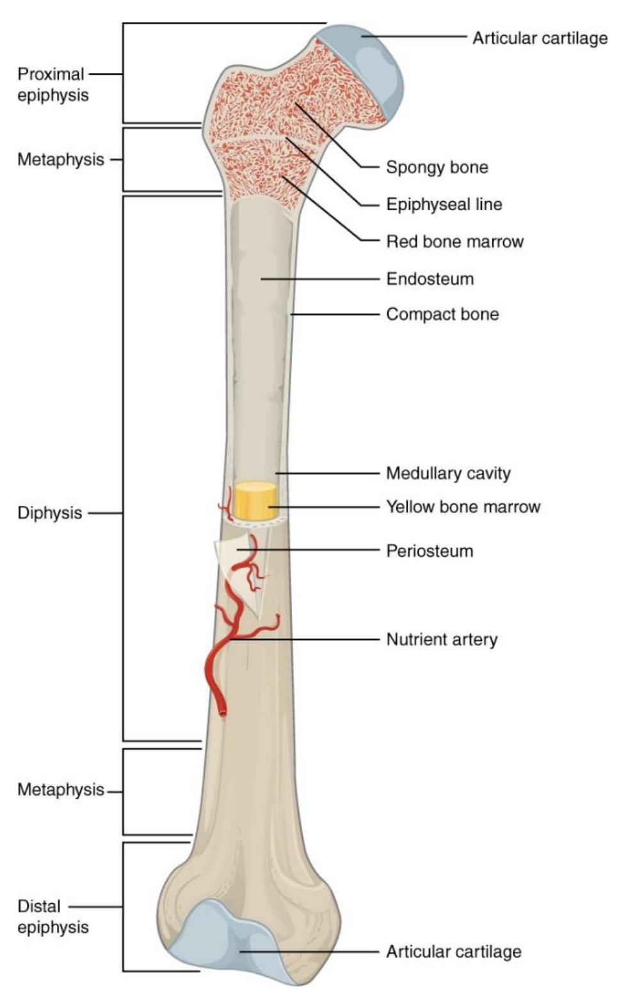

**Figure 6.11** Gross Anatomy of the Long Bone.

The cross-section of a long bone epiphysis.

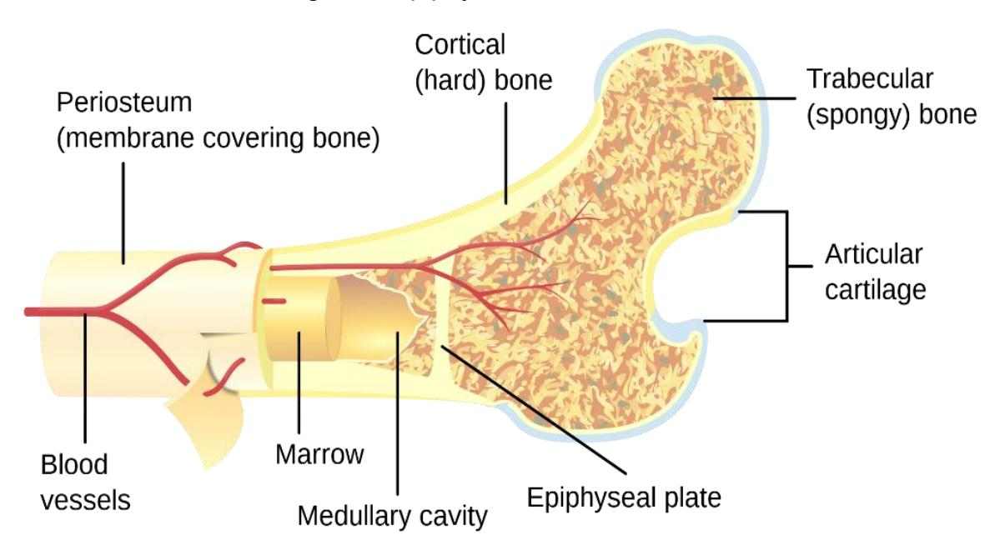

**Figure 6.12** The Cross-Section of a Bone.

## **Lab Activity 6.3.**

-   Find a dissected bone or a model of a bone and identify the compact and spongy bones based on their location and appearance.
-   What are the major anatomical differences between spongy and compact bone?
    -   spongy: porous, inner volume of epiphyses
    -   compact: dense, inner volume of long bones

### **Bone Histology: Compact Bone**

### **Lab Activity 6.4.**

-   Have someone obtain a microanatomy human bone model form the storage area.
-   Identify and label the features of the compact bone.
-   Take a picture of your work for later reference.
-   Have a lab mate from another group verify the identifications.

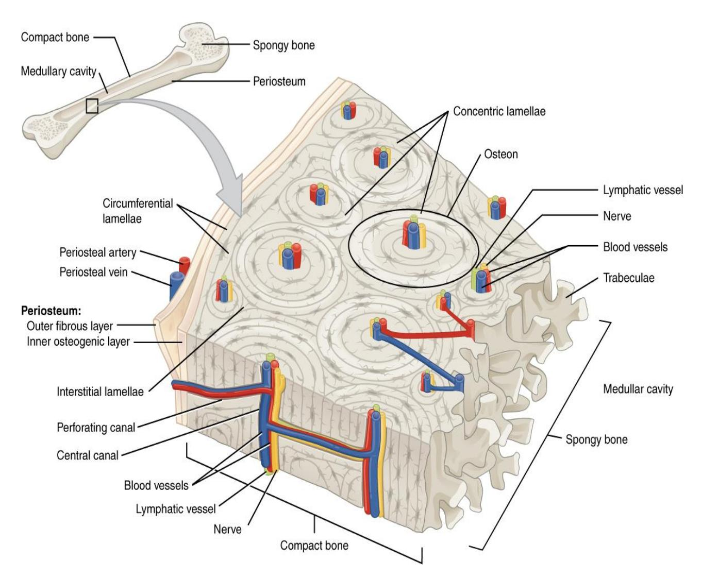

**Figure 6.13** Compact and Spongy Bone Cross Section.

## **Compact Bone Osteons**

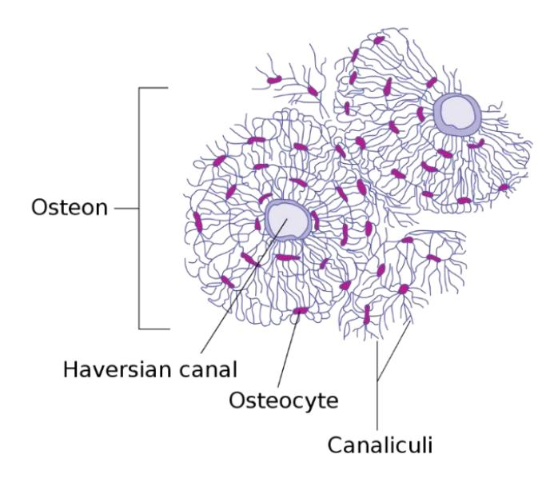

**Figure 6.14** Transverse Section of an Osteocyte.

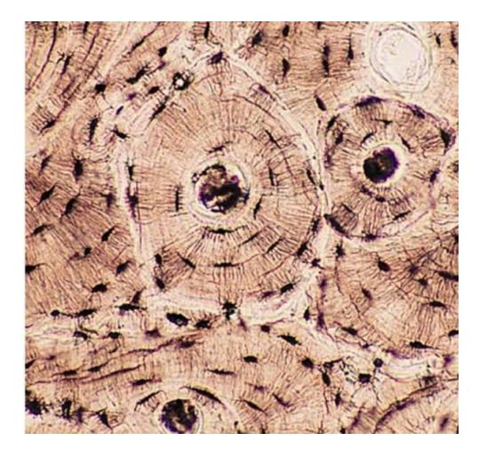

**Figure 6.15** Photomicrograph of compact bone.

### **Lab Activity 6.5: Microscope work:**

-   In groups of two obtain a microscope for this activity.
-   Using a light microscope, view the slide of a bone osteon at a magnification of 400x.
-   Draw and label each tissue type in the spaces provided. Your information should provide where it would be found in the body along with the magnification of the tissue.
-   Take a picture of the magnified osteon with your cell phone for later reference.

## **Spongy Bone**

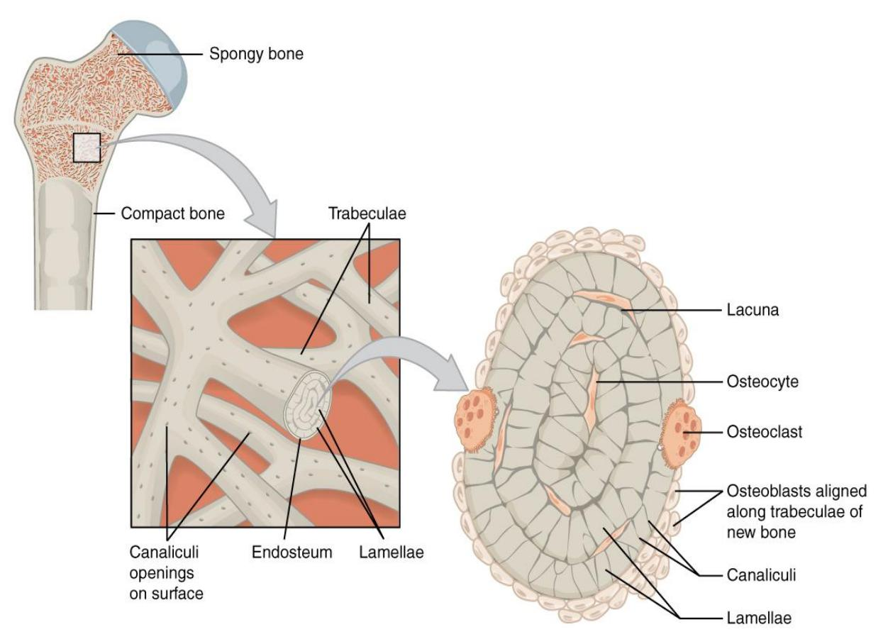

**Figure 6.16** Spongy Bone.

## **Additional Learning Resources**

-   **Watch** these videos to learn about the bones and markings of the axial skeleton:
    -   <https://youtu.be/kJNilqGxW3g>
    -   <https://youtu.be/LiLrDTcIbkQ>
    -   **Vertebrae:** <https://www.youtube.com/watch?v=V4qkP8nFMys>
    -   **Watch** these videos to learn about bones and markings of the appendicular skeleton:
        -   Bones of the upper extremity: <https://www.youtube.com/watch?v=7v2pwRwyWqU>
        -   Bones of the lower extremity: <https://www.youtube.com/watch?v=5ohJGtD3vRY>
        -   Bones of the pelvis:<https://www.youtube.com/watch?v=W8i7jlFa7qc>
    -   **Watch** these videos to help you identify left vs right for appendicular bones:
        -   <https://www.youtube.com/watch?v=0KPR9NSuGOA&feature=youtu.be> (most appendicular bones)
        -   <https://www.youtube.com/watch?v=kKGeEcrTMg8>(ilium, ischium, pubis)
        -   <https://www.youtube.com/watch?v=dVzlkGmm4Fg> (scapula**)**
    -   **More practice** identifying bones and markings of the skeletal system with these websites:
        -   <https://webanatomy.umn.edu/various-bones>
        -   <https://webanatomy.umn.edu/skulls-skeletons>
        -   <https://pierceanatomy.weebly.com/>
        -   <https://www.getbodysmart.com/skeletal-system>
        -   <http://www.personal.psu.edu/faculty/j/a/jas43/skel/skeletal.htm>

## **Post Lab Activities**

## **Post Lab Activity 6.1**

## **Crossword puzzles**

Complete the following crossword puzzles.

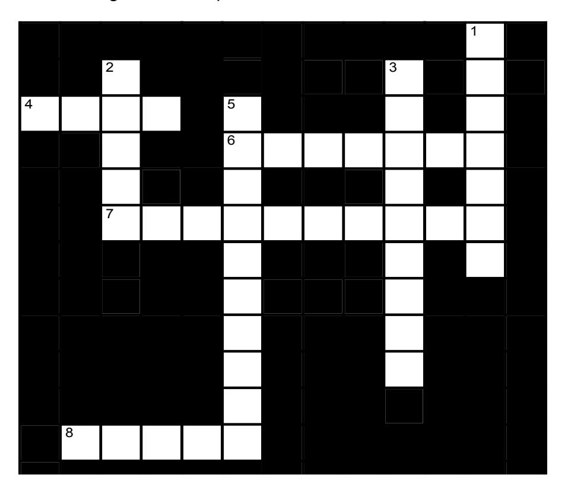

**Figure 6.17** Bone Features.

### **Across**

-   **4** A bony bulb or structure on a narrow neck is called a(n) \_\_head\_\_\_. (4)

-   **6** On a bone, a(n) \_\_\_process\_\_ is a structure which protrudes from a bone. These are often named for what they protrude toward. (7)

-   **7** On the femur, a(n) \_\_trochanter\_\_\_ refers to a large, blunt, unevenly shaped process. (10)

-   **8** A sharp, axe-like or needle-like projection on a bone is called a(n) \_\_spine\_\_\_. (5)

### **Down**

-   **1** On a bone, a(n) \_\_fissure\_\_\_ is a deep groove or notch. (7)

-   **2** The flat, smooth face on a bone where it meets another bone is called a(n) \_\_facet\_\_\_. (5)

-   **3** On a bone, a(n) \_\_\_crest\_\_ is a narrow ridge. A(n) \_\_\_line\_\_ is a smaller version. (5,4)

-   **5** A raised area on a condyle is called a(n) \_\_\_epicondyle\_\_. (10)

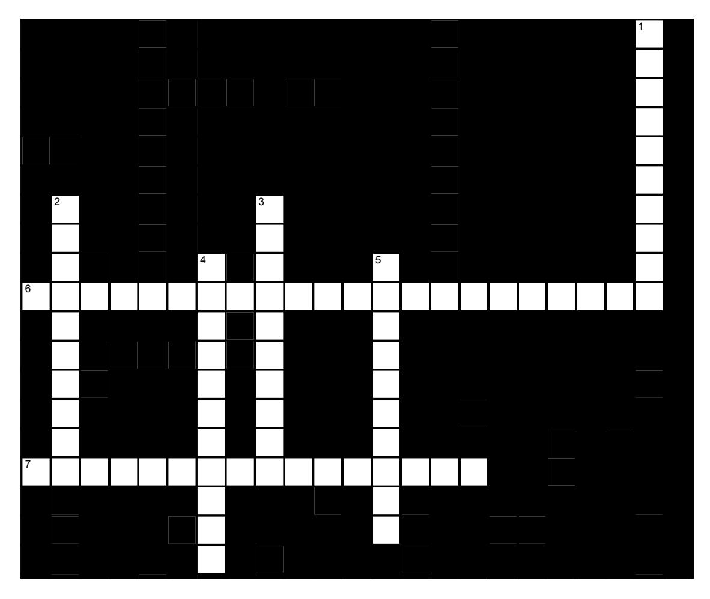

**Figure 6.18** Bone Structure.

### **Across**

**6** Compact bone consists of long, multi-layered cylinders called \_\_\_osteons\_\_, surrounded by a central, blood-vessel and nerve-containing canal called the \_\_Haversian canals\_\_\_. (7,9,6)

**7** Blood vessels and nerves may move from one Haversian canal to another by detouring through a(n) \_\_\_perforating canal\_\_. (11,5)

### **Down**

**1** Mature bone cells are called \_\_osteocytes\_\_\_ (10)

**2** Young, dividing cells usually have names that end in \_\_\_blast\_\_; mature cells usually have names that end in \_\_\_cytes\_\_. (10)

**3** Osteocytes in lacunae within an osteon maintain contact with one another by extending processes through \_\_canaliculi\_\_\_. (10)

**4** Cells that dissolve bone are called \_\_osteoclasts\_\_\_. (11)

**5** Bone-building cells are called \_\_osteoblasts\_\_\_. (10)

## **Post Lab Activity 6.2**

## **Matching**

**Table 6.4 Match the term(s) on the right with its corresponding statement.**

+-------------------+----------------------------------------------------------------------------------------------------------------------------------------+-----------------------+
| Answer            | Statement                                                                                                                              | Term(s)               |
+===================+========================================================================================================================================+=======================+
| Articular         | \_\_\_\_\_\_\_\_\_\_\_\_\_\_\_ cartilage covers ends of long bones.                                                                    | a\) axial             |
+-------------------+----------------------------------------------------------------------------------------------------------------------------------------+-----------------------+
| Perichondrium     | Skeletal cartilage is enclosed by the \_\_\_\_\_\_\_\_\_\_\_\_\_\_\_,                                                                  | b\) hyaline cartilage |
+-------------------+----------------------------------------------------------------------------------------------------------------------------------------+-----------------------+
| Appendicular      | The bones of the limbs, shoulders, and hips make up the \_\_\_\_\_\_\_\_\_\_\_\_\_\_\_ skeleton.                                       | c\) epiphyseal line   |
+-------------------+----------------------------------------------------------------------------------------------------------------------------------------+-----------------------+
| Epiphyses         | Cancellous bone is found in the \_\_\_\_\_\_\_\_\_\_\_\_\_\_\_ of long bones.                                                          | d\) Articular         |
+-------------------+----------------------------------------------------------------------------------------------------------------------------------------+-----------------------+
| Yellow marrow     | \_\_\_\_\_\_\_\_\_\_\_\_\_\_\_ is found in the central (medullary) cavity of an adult's long bones and is composed of fat.             | e\) perichondrium     |
+-------------------+----------------------------------------------------------------------------------------------------------------------------------------+-----------------------+
| Hyaline cartilage | Articular cartilage is composed of \_\_\_\_\_\_\_\_\_\_\_\_\_\_\_.                                                                     | f\) diaphysis;        |
+-------------------+----------------------------------------------------------------------------------------------------------------------------------------+-----------------------+
| Endosteum         | The inner surface of the bone, where it meets the marrow, is covered by a delicate membrane called the \_\_\_\_\_\_\_\_\_\_\_\_\_\_\_. | g\) Yellow marrow     |
+-------------------+----------------------------------------------------------------------------------------------------------------------------------------+-----------------------+
| Diaphysis         | The tubular shaft that forms the axis of long bones is called the \_\_\_\_\_\_\_\_\_\_\_\_\_\_\_.                                      | h\) appendicular      |
+-------------------+----------------------------------------------------------------------------------------------------------------------------------------+-----------------------+
| Axial             | The bones of the skull, rib cage, and vertebral column make up the \_\_\_\_\_\_\_\_\_\_\_\_\_\_\_ skeleton                             | i\) epiphyses         |
+-------------------+----------------------------------------------------------------------------------------------------------------------------------------+-----------------------+
| Epiphyseal line   | The line that separates the diaphysis from the epiphysis in a long bone is called the \_\_\_\_\_\_\_\_\_\_\_\_\_\_\_.                  | j\) endosteum         |
+-------------------+----------------------------------------------------------------------------------------------------------------------------------------+-----------------------+

## **Post Lab Activity 6.3**

## **Labeling**

Label the structures within the bone.

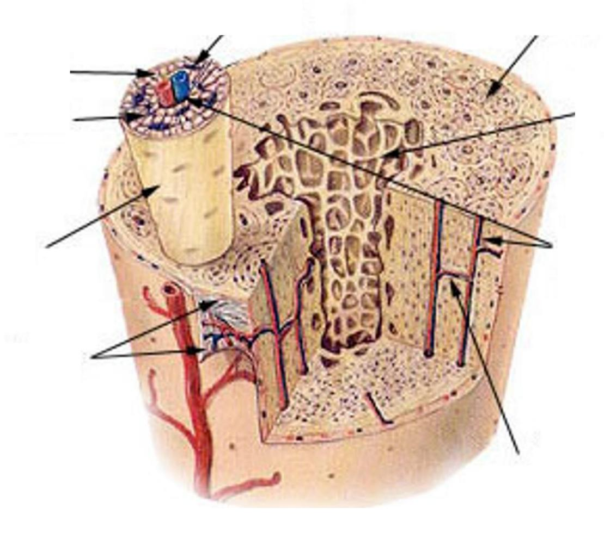

**Figure 6.19** Diagram of the Compact and Spongy Bone.

## **Keys**

## **Bone features**

• **Across: 4** Head, **6** Process, **7** Trochanter, **8** Spine.

• **Down: 1** Fissure, **2** Facet, **3** Crest line, **5** Epicondyle

## **Bone structure**

• **Across: 6** Osteons haversian canals, **7** Perforating canal.

• **Down: 1** Osteocytes, **2** Blastocyte, **3** Canaliculi, **4** Osteoclasts, **5** Osteoblast.

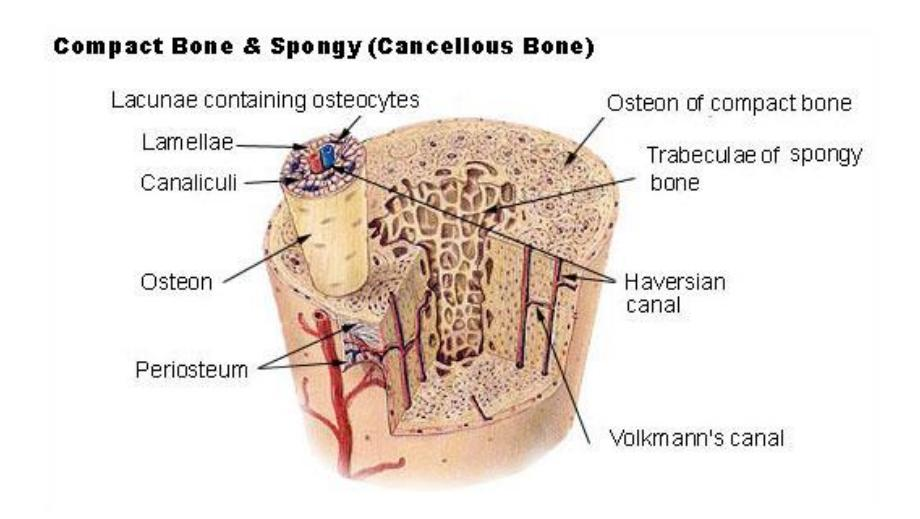

**Chapter 6: Skeletal Terms, Bone Histology, and Microanatomy**

+--------------------------------------------+----------------------------------------------------------------------------------------------------------------------------------------------------------------------------------------+
| Term                                       | Definition                                                                                                                                                                             |
+============================================+========================================================================================================================================================================================+
| appendicular skeleton                      | the part of the human skeleton which support the limbs and the girdles that attach them to the body.                                                                                   |
+--------------------------------------------+----------------------------------------------------------------------------------------------------------------------------------------------------------------------------------------+
| articular cartilage                        | thin layer of cartilage covering an epiphysis; reduces friction and acts as a shock absorber                                                                                           |
+--------------------------------------------+----------------------------------------------------------------------------------------------------------------------------------------------------------------------------------------+
| articulation                               | where two bone surfaces meet                                                                                                                                                           |
+--------------------------------------------+----------------------------------------------------------------------------------------------------------------------------------------------------------------------------------------+
| axial skeleton                             | forms the central axis of the human body, consisting of 80 bones that protect vital organs, including the skull, vertebral column, and thoracic cage                                   |
+--------------------------------------------+----------------------------------------------------------------------------------------------------------------------------------------------------------------------------------------+
| bone                                       | hard, dense connective tissue that forms the structural elements of the skeleton                                                                                                       |
+--------------------------------------------+----------------------------------------------------------------------------------------------------------------------------------------------------------------------------------------+
| canaliculi (singular = canaliculus)        | channels within the bone matrix that house one of an osteocyte's many cytoplasmic extensions that it uses to communicate and receive nutrients                                         |
+--------------------------------------------+----------------------------------------------------------------------------------------------------------------------------------------------------------------------------------------+
| cartilage                                  | semi-rigid connective tissue found on the skeleton in areas where flexibility and smooth surfaces support movement                                                                     |
+--------------------------------------------+----------------------------------------------------------------------------------------------------------------------------------------------------------------------------------------+
| central canal                              | longitudinal channel in the center of each osteon; contains blood vessels, nerves, and lymphatic vessels; also known as the Haversian canal                                            |
+--------------------------------------------+----------------------------------------------------------------------------------------------------------------------------------------------------------------------------------------+
| compact bone                               | dense osseous tissue that can withstand compressive forces                                                                                                                             |
+--------------------------------------------+----------------------------------------------------------------------------------------------------------------------------------------------------------------------------------------+
| diaphysis                                  | tubular shaft that runs between the proximal and distal ends of a long bone                                                                                                            |
+--------------------------------------------+----------------------------------------------------------------------------------------------------------------------------------------------------------------------------------------+
| endochondral ossification                  | process in which bone forms by replacing hyaline cartilage                                                                                                                             |
+--------------------------------------------+----------------------------------------------------------------------------------------------------------------------------------------------------------------------------------------+
| endosteum                                  | delicate membranous lining of a bone's medullary cavity                                                                                                                                |
+--------------------------------------------+----------------------------------------------------------------------------------------------------------------------------------------------------------------------------------------+
| epiphyseal line                            | completely ossified remnant of the epiphyseal plate                                                                                                                                    |
+--------------------------------------------+----------------------------------------------------------------------------------------------------------------------------------------------------------------------------------------+
| epiphyseal plate (also, growth plate)      | sheet of hyaline cartilage in the metaphysis of an immature bone; replaced by bone tissue as the organ grows in length                                                                 |
+--------------------------------------------+----------------------------------------------------------------------------------------------------------------------------------------------------------------------------------------+
| epiphysis                                  | wide section at each end of a long bone; filled with spongy bone and red marrow                                                                                                        |
+--------------------------------------------+----------------------------------------------------------------------------------------------------------------------------------------------------------------------------------------+
| flat bone                                  | thin and curved bone; serves as a point of attachment for muscles and protects internal organs                                                                                         |
+--------------------------------------------+----------------------------------------------------------------------------------------------------------------------------------------------------------------------------------------+
| foramen                                    | an opening or passage in the body, particularly in bones, which allows nerves, arteries, veins, or other structures to pass through                                                    |
+--------------------------------------------+----------------------------------------------------------------------------------------------------------------------------------------------------------------------------------------+
| fracture                                   | broken bone                                                                                                                                                                            |
+--------------------------------------------+----------------------------------------------------------------------------------------------------------------------------------------------------------------------------------------+
| fracture hematoma                          | blood clot that forms at the site of a broken bone                                                                                                                                     |
+--------------------------------------------+----------------------------------------------------------------------------------------------------------------------------------------------------------------------------------------+
| hematopoiesis                              | production of blood cells, which occurs in the red marrow of the bones                                                                                                                 |
+--------------------------------------------+----------------------------------------------------------------------------------------------------------------------------------------------------------------------------------------+
| hole                                       | opening or depression in a bone                                                                                                                                                        |
+--------------------------------------------+----------------------------------------------------------------------------------------------------------------------------------------------------------------------------------------+
| intramembranous ossification               | process by which bone forms directly from mesenchymal tissue                                                                                                                           |
+--------------------------------------------+----------------------------------------------------------------------------------------------------------------------------------------------------------------------------------------+
| irregular bone                             | bone of complex shape; protects internal organs from compressive forces                                                                                                                |
+--------------------------------------------+----------------------------------------------------------------------------------------------------------------------------------------------------------------------------------------+
| lacunae (singular = lacuna)                | spaces in a bone that house an osteocyte                                                                                                                                               |
+--------------------------------------------+----------------------------------------------------------------------------------------------------------------------------------------------------------------------------------------+
| long bone                                  | cylinder-shaped bone that is longer than it is wide; functions as a lever                                                                                                              |
+--------------------------------------------+----------------------------------------------------------------------------------------------------------------------------------------------------------------------------------------+
| medullary cavity                           | hollow region of the diaphysis; filled with yellow marrow                                                                                                                              |
+--------------------------------------------+----------------------------------------------------------------------------------------------------------------------------------------------------------------------------------------+
| modeling                                   | process, during bone growth, by which bone is resorbed on one surface of a bone and deposited on another                                                                               |
+--------------------------------------------+----------------------------------------------------------------------------------------------------------------------------------------------------------------------------------------+
| nutrient foramen                           | small opening in the middle of the external surface of the diaphysis, through which an artery enters the bone to provide nourishment                                                   |
+--------------------------------------------+----------------------------------------------------------------------------------------------------------------------------------------------------------------------------------------+
| orthopedist                                | doctor who specializes in diagnosing and treating musculoskeletal disorders and injuries                                                                                               |
+--------------------------------------------+----------------------------------------------------------------------------------------------------------------------------------------------------------------------------------------+
| osseous tissue                             | bone tissue: a hard, dense connective tissue that forms the structural elements of the skeleton                                                                                        |
+--------------------------------------------+----------------------------------------------------------------------------------------------------------------------------------------------------------------------------------------+
| ossification (also, osteogenesis)          | bone formation                                                                                                                                                                         |
+--------------------------------------------+----------------------------------------------------------------------------------------------------------------------------------------------------------------------------------------+
| ossification center                        | cluster of osteoblasts found in the early stages of intramembranous ossification                                                                                                       |
+--------------------------------------------+----------------------------------------------------------------------------------------------------------------------------------------------------------------------------------------+
| osteoblast                                 | cell responsible for forming new bone                                                                                                                                                  |
+--------------------------------------------+----------------------------------------------------------------------------------------------------------------------------------------------------------------------------------------+
| osteoclast                                 | cell responsible for resorbing bone                                                                                                                                                    |
+--------------------------------------------+----------------------------------------------------------------------------------------------------------------------------------------------------------------------------------------+
| osteocyte                                  | primary cell in mature bone; responsible for maintaining the matrix                                                                                                                    |
+--------------------------------------------+----------------------------------------------------------------------------------------------------------------------------------------------------------------------------------------+
| osteogenic cell                            | undifferentiated cell with high mitotic activity; the only bone cells that divide; they differentiate and develop into osteoblasts                                                     |
+--------------------------------------------+----------------------------------------------------------------------------------------------------------------------------------------------------------------------------------------+
| osteoid                                    | uncalcified bone matrix secreted by osteoblasts                                                                                                                                        |
+--------------------------------------------+----------------------------------------------------------------------------------------------------------------------------------------------------------------------------------------+
| osteon (also, Haversian system)            | basic structural unit of compact bone; made of concentric layers of calcified matrix                                                                                                   |
+--------------------------------------------+----------------------------------------------------------------------------------------------------------------------------------------------------------------------------------------+
| osteoporosis                               | disease characterized by a decrease in bone mass; occurs when the rate of bone resorption exceeds the rate of bone formation, a common occurrence as the body ages                     |
+--------------------------------------------+----------------------------------------------------------------------------------------------------------------------------------------------------------------------------------------+
| perforating canal (also, Volkmann's canal) | channel that branches off from the central canal and houses vessels and nerves that extend to the periosteum and endosteum                                                             |
+--------------------------------------------+----------------------------------------------------------------------------------------------------------------------------------------------------------------------------------------+
| perichondrium                              | membrane that covers cartilage                                                                                                                                                         |
+--------------------------------------------+----------------------------------------------------------------------------------------------------------------------------------------------------------------------------------------+
| periosteum                                 | fibrous membrane covering the outer surface of bone and continuous with ligaments                                                                                                      |
+--------------------------------------------+----------------------------------------------------------------------------------------------------------------------------------------------------------------------------------------+
| primary ossification                       | region, deep in the periosteal collar, where bone development starts during                                                                                                            |
+--------------------------------------------+----------------------------------------------------------------------------------------------------------------------------------------------------------------------------------------+
| center                                     | endochondral ossification                                                                                                                                                              |
+--------------------------------------------+----------------------------------------------------------------------------------------------------------------------------------------------------------------------------------------+
| projection                                 | bone markings where part of the surface sticks out above the rest of the surface, where tendons and ligaments attach                                                                   |
+--------------------------------------------+----------------------------------------------------------------------------------------------------------------------------------------------------------------------------------------+
| proliferative zone                         | region of the epiphyseal plate that makes new chondrocytes to replace those that die at the diaphyseal end of the plate and contributes to longitudinal growth of the epiphyseal plate |
+--------------------------------------------+----------------------------------------------------------------------------------------------------------------------------------------------------------------------------------------+
| red marrow                                 | connective tissue in the interior cavity of a bone where hematopoiesis takes place                                                                                                     |
+--------------------------------------------+----------------------------------------------------------------------------------------------------------------------------------------------------------------------------------------+
| remodeling                                 | process by which osteoclasts resorb old or damaged bone at the same time as and on the same surface where osteoblasts form new bone to replace that which is resorbed                  |
+--------------------------------------------+----------------------------------------------------------------------------------------------------------------------------------------------------------------------------------------+
| secondary ossification center              | region of bone development in the epiphyses                                                                                                                                            |
+--------------------------------------------+----------------------------------------------------------------------------------------------------------------------------------------------------------------------------------------+
| sesamoid bone                              | small, round bone embedded in a tendon; protects the tendon from compressive forces                                                                                                    |
+--------------------------------------------+----------------------------------------------------------------------------------------------------------------------------------------------------------------------------------------+
| short bone                                 | cube-shaped bone that is approximately equal in length, width, and thickness; provides limited motion                                                                                  |
+--------------------------------------------+----------------------------------------------------------------------------------------------------------------------------------------------------------------------------------------+
| skeletal system                            | organ system composed of bones and cartilage that provides for movement, support, and protection                                                                                       |
+--------------------------------------------+----------------------------------------------------------------------------------------------------------------------------------------------------------------------------------------+
| spongy bone (also, cancellous bone)        | trabeculated osseous tissue that supports shifts in weight distribution                                                                                                                |
+--------------------------------------------+----------------------------------------------------------------------------------------------------------------------------------------------------------------------------------------+
| trabeculae (singular = trabecula)          | spikes or sections of the lattice-like matrix in spongy bone                                                                                                                           |
+--------------------------------------------+----------------------------------------------------------------------------------------------------------------------------------------------------------------------------------------+
| yellow marrow                              | connective tissue in the interior cavity of a bone where fat is stored                                                                                                                 |
+--------------------------------------------+----------------------------------------------------------------------------------------------------------------------------------------------------------------------------------------+
| zone of calcified matrix                   | region of the epiphyseal plate closest to the diaphyseal end; functions to connect the epiphyseal plate to the diaphysis                                                               |
+--------------------------------------------+----------------------------------------------------------------------------------------------------------------------------------------------------------------------------------------+
| zone of maturation and hypertrophy         | region of the epiphyseal plate where chondrocytes from the proliferative zone grow and mature and contribute to the longitudinal growth of the epiphyseal plate                        |
+--------------------------------------------+----------------------------------------------------------------------------------------------------------------------------------------------------------------------------------------+
